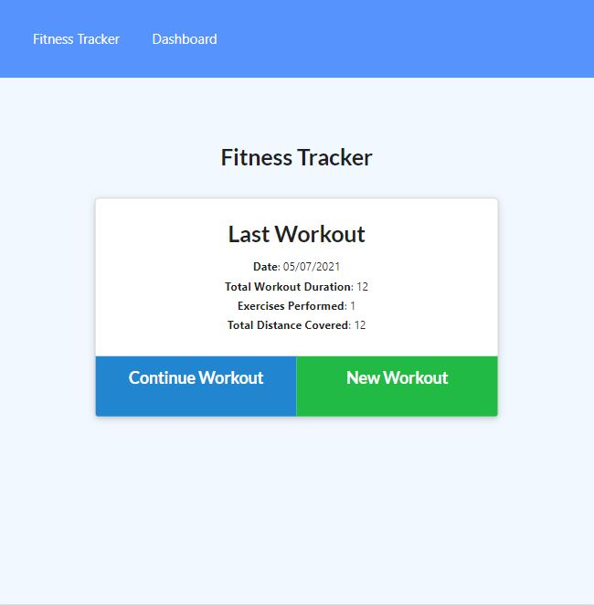

# Workout-Tracker

## Description
This workout tracker will help a consumer reach their fitness goals. The consumer will be able to create workout plans
and has a page to view their progress.

### Live Link:
https://scenic-voyageurs-87933.herokuapp.com/?id=60e279ad18009e0015544582

## Table of Contents
- [User Story](#user-story)
- [Installation](#installation)
- [Usage](#usage)
- [Results](#results)
- [Contribution](#contribution)
- [License](#license)
- [Questions](#questions)

## User Story
As a user, I want to be able to view create and track daily workouts. I want to be able to log multiple exercises in a 
workout on a given day. I should also be able to track the name, type, weight, sets, reps, and duration of exercise. 
If the exercise is a cardio exercise, I should be able to track my distance traveled.

## Installation
npm install

## Usage
npm seed
npm start

## Results

## License
MIT License

Copyright (c) 2021 Kate McColl

## Contribution
Open to contributions

## Questions
If you have any questions, please contact me by Email: kate@katemccollart.com GitHub: [katemccoll](https://github.com/katemccoll)
